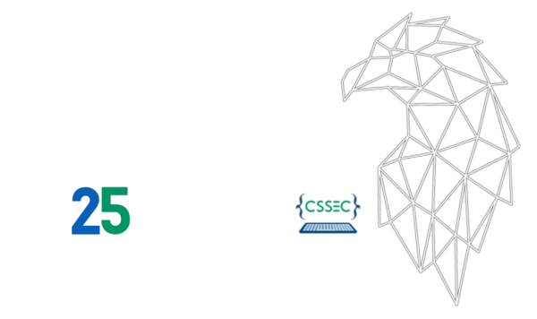

# 
 AD Some AI 

    

# 

**AD Some AI** is an innovative platform that streamlines the ad creation process by leveraging artificial intelligence. Simply input a keyword, and our system will generate keyword-rich titles, pitches, and descriptions to optimize engagement. But that’s not all—AD Some AI also creates high-quality images tailored to your brand and incorporates your text directly onto those images. AD Some AI automates the entire process, saving you time while ensuring your ads are visually compelling and ready to use.

## Team 'git push --force'
    
- **Daniel Kareh**: User authentication and database creation.
- **William Murphy**: Data analytics and frontend development.
- **William Ward**: Frontend, backend, server development, and API communications.
- **David West**: FastAPI development, ad generation, and prompt engineering.

## Project Inspiration

Our project was inspired by a request from the company **Eightpoint** to develop a solution that uses AI API connections to generate personalized ads based on a keyword or search term. They specified that the generated text should include a title, description, and a call to action. Motivated by this challenge, we leveraged OpenAI's API to not only generate text but also create images based on this text.

By doing this, we are able to generate ads using AI that include titles, descriptions, and calls to action directly on the images, providing all-in-one ads ready for use.

## Key Features

- **AI-Generated Ad Content**:  
  Simply input a keyword, and AD Some AI instantly generates keyword-rich, grammatically accurate ad titles, pitches, and descriptions optimized for engagement.

- **Automated Image Creation**:  
  AD Some AI generates images tailored to your ad's theme, ensuring they align with your brand and marketing goals.

- **Text Overlay on Images**:  
  Automatically integrates your generated ad copy onto images, creating cohesive and professional-looking ads without the need for design expertise.

- **Fast & Easy-to-Use**:  
  A user-friendly platform that requires minimal input—just a keyword—and delivers complete ad content, including both text and visuals, in minutes.

- **Scalable Solution**:  
  Perfect for businesses and marketers who need to create a large volume of ads efficiently, maintaining consistency across all materials.

- **Optimized for Engagement**:  
  Every generated ad copy is designed with keyword optimization in mind to boost visibility and engagement across search engines and social media.

- **Cloud-Based Platform**:  
  Fully accessible from anywhere via the web, with no downloads or installation required.

## How to Use Ad Generator

1. **Go to Website**  
   Visit the AD Some AI website in your browser.

2. **Login / Register**  
   If you're a new user, register for an account. If you're returning, simply log in.

3. **Dashboard**  
   Once logged in, you will be directed to the dashboard page, where you can access all available features.

4. **Navigate to Ad Generation Page**  
   From the dashboard, go to the **Ad Generation** page.

5. **Input Keywords**  
   Enter up to 3 different categories of keywords:  
   - **Product/Service Overview**  
   - **Target Audience**  
   - **Campaign Goal**

6. **Generate Ads**  
   Simply click the **Generate Ads** button and wait while AD Some AI creates your tailored ads with optimized text and images.

7. **Download or Use**  
   Once the ads are ready, you can download or directly use them for your campaigns.

## The API Workflow - From Keywords to Advertisement

Our API takes as little as a single keyword and turns it into 3 ad campaigns with a sample advertisement. To do this, we take a page out of how 'reasoning' AI models work: We prompt and re-prompt the AI, using its previous response to fill in next prompt in our pipeline. All text generation uses OpenAI's GPT 4o-mini model and images are generated by Dall-E 3.

1. **The Request**
   
   We start by receiving a request at the POST /new_job endpoint. The request requires a valid API key in the header, which is checked by middleware for all endpoints, as well as a form body with a product/service (aka keyword) for the ads. Optionally, the user can also provide an intended audience and a marketing goal.

   Additionally, an GET /job/{job_id} endpoint can be polled to get the current status of a given job.

2. **Creating a Campaign "Mood"**
   
    We begin our AI prompting pipeline by asking it to choose 3 concept categories that best represent the keyword. The categories are based on [marketing color theory](https://blog.hubspot.com/the-hustle/psychology-of-color), and allow us to choose a color scheme for the advertisements that will align with its message for a cohesive campaign.
   
3. **Generating an Ad Campaign**
   
    At this point, the AdGenerator service develops 3 ad campaigns in parallel, based on each of the selected moods.
   
    The keyword, audience, goal, and mood, are inserted into a prompt asking the AI to generate details for an ad campaign consisting of a title, description, and key message. At this stage, we also ask it for details of what a potential image in an ad from this campaign would feature and what emotion it would intend to envoke in the viewer.

4. **Generating the Ad Copy**
   
   Next we use the campaign details generated in the previous step along with the terms in the mood category to create the highlight, body text, and call to action for a single advertisement in this campaign. The prompt includes ensuring the keyword is featured in each section.

5. **Generating the Ad Image**
    
   We then prompt an image generation AI model to create an image based on the keyword and audience, as well as the image details and emotion generated in step 3. We also ask that the image's color scheme reflect the campaign's "mood" color.

6. **Creating a Cohesive Advertisement**
    
   Finally, we take the ad copy and image and combine them in a template to create the final advertisement. The campaign's mood color is used for the highlight text color and the call to action's background color. Performing this step in a template ensures we have consistent results and is extensible, allowing for additional templates to be created.

7. **The Response**
    
    We now change the job's status to reflect that it is completed, move the job's directory into a mounted directory for hosting, and on the next query at the GET /job/{job_id}, respond with the new status and links to the ad PNG images.

## Example Images

The following images were generated using the keyword "coffee", with an intended audience of women aged 18-35 and a goal of awareness of health benefits.

### Orange Campaign - Highlighting Warmth, Energy, and Creativity

### Green Campaign - Highlighting Nature, Growth, and Health

### Black Campaign - Highlighting Sophistication, Power, & Mystery

